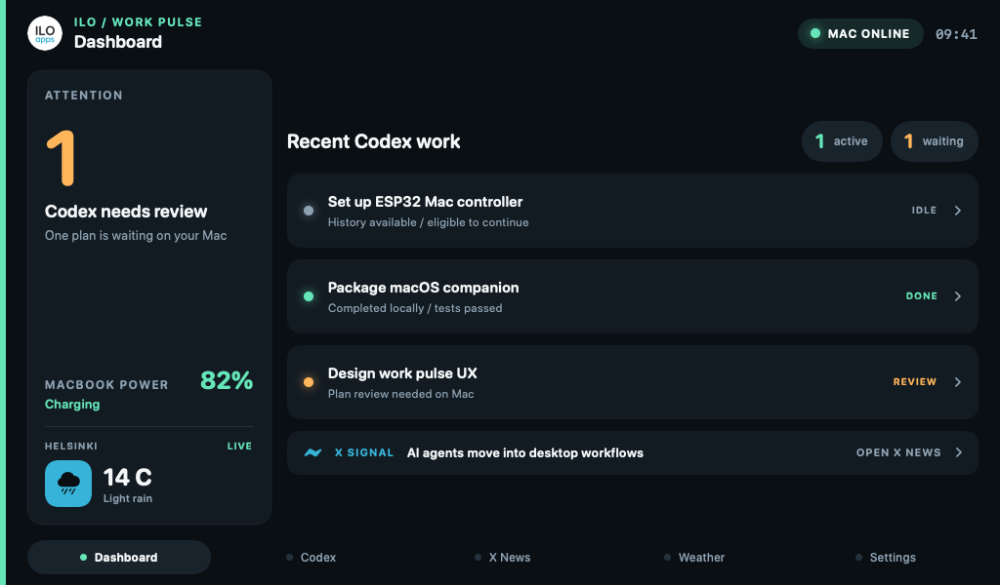
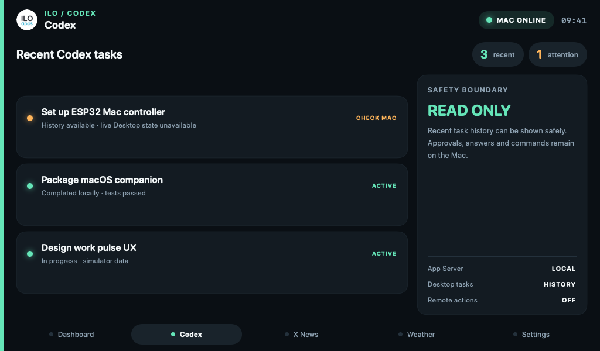
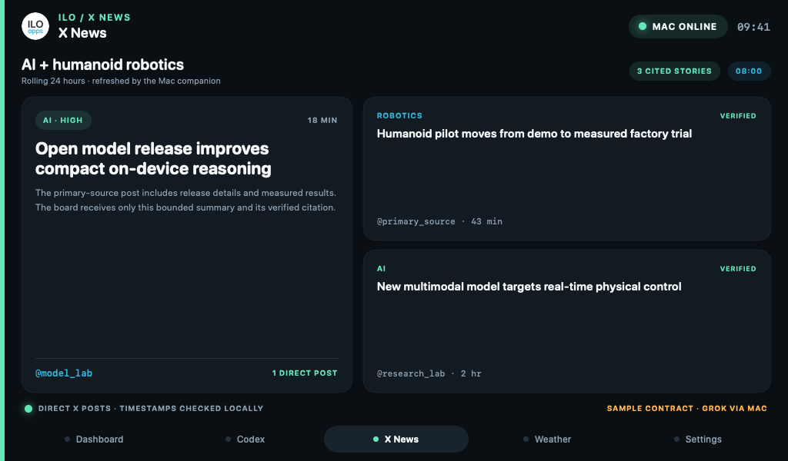
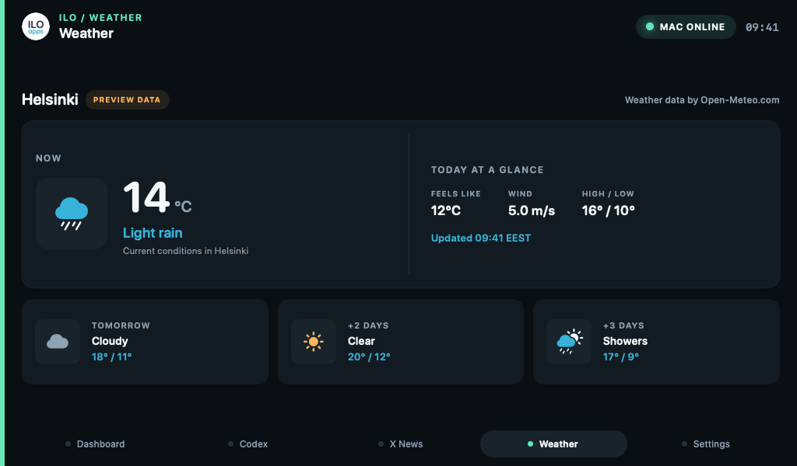
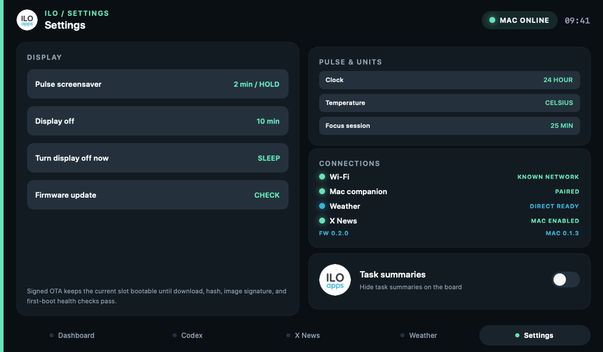

# ILO Board

Touch-first companion software for the Waveshare ESP32-S3-Touch-LCD-5B and macOS.

> **macOS download:** [Download the latest notarized universal DMG](https://storage.googleapis.com/ilo-public/ilo-board/ILOBoard-latest.dmg) for macOS 13 or newer. Move **ILO Board.app** to Applications after opening the DMG; future releases can then update in place through the signed Sparkle feed.

## Supported hardware

This firmware targets one exact board profile:

- **Waveshare ESP32-S3-Touch-LCD-5B**
- Waveshare SKU **28151**
- **1024×600** 5-inch capacitive-touch RGB display
- Amazon ASIN **B0DD7N19FT** — [buy the same board on Amazon.de](https://www.amazon.de/dp/B0DD7N19FT)

The no-suffix `ESP32-S3-Touch-LCD-5` (SKU 28117, 800×480) is a different display profile and is not supported by this firmware build.

The repository has two runtime halves:

- `firmware/` — ESP-IDF 5.5.2 firmware for the 1024×600 Waveshare 5B board (SKU 28151), using LVGL 9.
- `mac-service/` — a native Swift service plus a clean menu-bar companion that shows board connectivity and sends a deliberately small task-status model.

Shared wire contracts live in `protocol/`; board lifecycle tooling lives in `tools/`.

## Current phase

Phase 1 keeps Codex access narrow. Recent task metadata remains read-only, while one fixed board-originated action can resume an eligible idle task with exactly `Please continue.` after a hold and separate confirmation. A second narrowly bounded, rate-limited action can refresh X News after prior Mac-side opt-in. The physical 5B display, GT911 touch, USB provisioning, Wi-Fi connection, TLS-PSK authentication, macOS menu-bar status, and recurring board snapshot delivery are hardware-verified. The Mac companion reads real recent task history through the supported local Codex App Server and shares only bounded board-facing data: MacBook power state, local timezone, and—only after explicit permission—coarse weather coordinates. Deterministic mock task data remains available for demos and tests. The board still cannot approve commands, apply file changes, answer questions, send arbitrary text, or grant permissions.

Hardware-independent development can continue without a board: the Swift service and tests, universal `.app`/DMG packaging, protocol work, generated UI assets, firmware compilation, and desktop UI previews do not require a connected display. Flashing, live touch behavior, RGB timing, backlight control, Wi-Fi behavior, power use, and actual-device screenshots remain hardware verification gates.

## Requirements

### Hardware

- Waveshare **ESP32-S3-Touch-LCD-5B**, SKU **28151**, 1024×600. The 800×480 no-suffix board is not compatible.
- A data-capable USB-C cable. A charge-only cable can power the display but cannot flash or provision it.
- Direct Mac USB or a powered hub capable of supplying the display reliably. Keep the board's battery switch **off** during USB debugging.
- A 2.4 GHz WPA2/WPA3 Personal Wi-Fi network for wireless operation. The ESP32-S3 does not use a 5 GHz-only network.

### Mac development machine

- macOS 13 Ventura or newer. Development is currently verified on macOS 15.7.7.
- Xcode Command Line Tools or Xcode with Swift 6.2-compatible tooling: `xcode-select --install`.
- Git, CMake, Ninja, and Python 3. The pinned ESP-IDF installer reports anything missing.
- macOS Keychain access. Pairing stores the per-board TLS secret in the login Keychain. The installed app explains its one-time migration before macOS asks for your normal Mac login password; ordinary later launches do not prompt.
- Local Network permission for the packaged menu-bar app.
- For Codex integration: a supported local `codex` CLI that is installed and authenticated. No Codex token is stored on the board.
- Optional X News integration: `grok` CLI 1.0.0 or a compatible newer build, authenticated with an account that can search X. Set `ILO_BOARD_GROK_PATH` if it is not on `PATH` or under `~/.local/bin`. Grok authentication remains on the Mac.

### Network

- The Mac and board must be able to reach each other on the same LAN.
- Client/AP isolation must be disabled.
- Bonjour discovery requires multicast DNS between clients. Firmware now looks for the paired Mac's `_iloboard._tcp` instance, accepts only protocol-v1 `tls-psk-tcp` TXT metadata, and otherwise retains the provisioned Mac address as a recovery fallback. This path is compile-verified and awaits a physical LAN/reconnect test.
- Wi-Fi provisioning currently accepts WPA2/WPA3 Personal passwords of 8–63 UTF-8 bytes. Enterprise and open Wi-Fi are not supported yet.

## Quick start

```bash
make help
make firmware-setup
make firmware-build
make mac-test

./tools/board doctor
./tools/board chip-id
./tools/host doctor
```

`firmware-build`, `mac-build`, `mac-test`, `app`, and the release-tool checks are useful without physical hardware. Commands that query, flash, provision, reboot, monitor, or capture a real board require USB or Wi-Fi access to the board.

### First board setup

```bash
./tools/setup-idf
make firmware-build
./tools/board backup
./tools/board flash
./tools/board provision
./tools/host menu
```

`board provision` is the complete USB recovery/bootstrap route: it prompts for Wi-Fi details, a recovery Mac address, and an optional weather location; hides the Wi-Fi password; generates a unique 32-byte pairing key; stores the host copy in macOS Keychain; and writes only the ESP NVS data partition over USB. Secrets are never passed as command-line arguments or written into the repository. After that first setup, Wi-Fi can also be changed directly on the board from **Settings → Wi-Fi** with a masked touch keyboard; it saves only to board NVS and reconnects without the Mac. USB provisioning remains the recovery route and the only way to create/reset the Mac pairing identity.

`host menu` starts a menu-bar-only macOS companion with connection state, last sync, board identity, firmware and companion versions, service port, security mode, and safe start/stop diagnostics. The board Settings page shows the same two versions after an authenticated sync. Use `./tools/host serve` for the headless development service.

In the signed app, **Launch at login → Enable** explicitly registers the main application with macOS Service Management. The first run may have no Background Items record yet; the app presents that as **Off**, not as an installation failure, and the Enable action creates the record. If macOS requires separate consent, choose **Review Login Items** and allow ILO Board under **System Settings → General → Login Items**. Development binaries outside Applications intentionally cannot register.

The first signed-app launch after CLI provisioning does **not** open an unexplained Keychain dialog. Open the menu, review the **One-time secure pairing access** card, and choose **Continue & Authorize…**. macOS then asks whether ILO Board may access the provisioning credential: enter your normal Mac login password and choose **Allow**. The app copies the same 32-byte PSK into its own protected Keychain item, never displays or uploads it, and uses that app-owned item silently on later launches and signed updates. The original item remains available to the headless CLI and screenshot tools.

## Command reference

There is no Node/npm layer in this repository. The stable entry points are `make`, `./tools/board`, and `./tools/host`.

| Goal | Command | Board required |
| --- | --- | --- |
| Show all common commands | `make help` | No |
| Show both software versions | `make versions` | No |
| Regenerate shared macOS/firmware icon assets | `make assets` | No |
| Check local prerequisites and USB detection | `make doctor` | Only for USB status |
| Install pinned ESP-IDF 5.5.2 | `make firmware-setup` | No |
| Compile firmware | `make firmware-build` | No |
| Show firmware version | `make firmware-version` | No |
| Bump firmware patch/minor only | `make firmware-version-patch` / `make firmware-version-minor` | No |
| Patch-bump and flash firmware | `make firmware-flash` | Yes, USB |
| Minor-bump and flash firmware | `make firmware-flash-minor` | Yes, USB |
| Open serial monitor | `make firmware-monitor` | Yes, USB |
| Inspect OTA safety gates | `make ota-status` | No |
| Create the external encrypted OTA signing key | `make firmware-key-create` | No |
| Build/sign/verify a firmware release | `make firmware-release-local` | No |
| Publish a verified firmware release | `make firmware-release-distribute` | GCS only |
| Verify a signed OTA artifact | `./tools/board ota-verify --image IMAGE --public-key PUBLIC.pem --sdkconfig SDKCONFIG` | No |
| Open interactive 1024×600 UI preview | `make ui-preview` | No |
| Export all five simulator screenshots | `make ui-screenshots` | No |
| Export one simulator screenshot | `./tools/board ui-screenshot --screen codex` | No |
| Save the current physical board screen | `make board-screenshot` | Yes, Wi-Fi |
| Identify chip | `./tools/board chip-id` | Yes, USB |
| Back up the complete 16 MB flash | `./tools/board backup` | Yes, USB |
| Securely provision Wi-Fi/pairing | `./tools/board provision` | Yes, USB |
| Reboot from download mode | `./tools/board reboot` | Yes, USB |
| Build the Swift package | `make mac-build` | No |
| Test the Swift host/protocol | `make mac-test` | No |
| Inspect one sanitized status snapshot | `./tools/host snapshot` | No |
| Run the menu-bar app from source | `make mac-menu` | No; board status stays offline |
| Run the headless Codex service | `make mac-run` or `./tools/host serve` | No; board status stays offline |
| Run the service with sample tasks | `./tools/host serve --mock` | No |
| Inspect optional X News state | `./tools/host x-news status` | No |
| Fetch a verified rolling 24h X feed | `./tools/host x-news refresh --allow-grok-tools` | No |
| Enable daily X News | `./tools/host x-news enable --allow-grok-tools` | No |
| Disable and hide X News | `./tools/host x-news disable` | No |
| Capture the live board framebuffer | `./tools/host screenshot --output board.png` | Yes, Wi-Fi |
| Build universal `.app` | `make app` | No |
| Build local DMG | `make package-dmg` | No |
| Show Mac companion version/build | `make mac-version` | No |
| Prepare next Mac patch/minor release | `make mac-version-patch` / `make mac-version-minor` | No |
| Build and notarize release | `make release-local` | No |
| Upload DMGs and signed Sparkle feed | `make release-distribute` | No |
| Run every hardware-independent test | `make test` | No |
| Test host/release tooling and compile firmware | `make verify` | No |

`./tools/board --help` and `./tools/host --help` are the authoritative detailed command lists.

Firmware has its own semantic version in `firmware/version.txt`; ESP-IDF embeds that value in the application image. `make firmware-flash` (and direct `./tools/board flash`) first resolves a connected USB board, then patch-bumps the version before compiling and flashing. Use `make firmware-flash-minor` or `./tools/board flash --version-bump minor` when the change deserves a minor increment. A failed USB detection does not consume a version. The standalone firmware bump targets are useful when preparing an image without flashing it.

The Mac companion keeps its existing release-safe workflow in `Config/version.env`. `make mac-version-patch` and `make mac-version-minor` are descriptive aliases for the existing release commands; they require a clean worktree, increment the app build number, and prepare the changelog before signing or publishing.

### OTA foundation

The partition table already reserves equal 4 MiB `ota_0` and `ota_1` slots. Rollback is enabled for clean builds, and a newly installed image stays `PENDING_VERIFY` until board/UI initialization succeeds and a 30-second runtime/heap health window passes. A crash, reset, failed health check, or failure to persist the valid state keeps the image unconfirmed and selects the previous valid slot when recovery is available.

Normal developer firmware deliberately keeps OTA disabled. The release-only profile adds a board-owned HTTPS updater: it automatically checks the pinned signed GCS manifest after Wi-Fi connects, but installation remains an explicit tap in Settings or click in the paired Mac companion. The Mac sends only fixed `check`/`install` actions; the board independently refetches its pinned manifest and never accepts a URL, binary, hash, version, or key from the Mac. It verifies the manifest signature, exact 5B target, immutable URL, monotonic sequence, size and SHA-256, then lets ESP-IDF verify the signed app before selecting the inactive slot. The existing 30-second first-boot health gate confirms or rolls back the new image. Private signing keys must remain outside this repository. See [the OTA policy](docs/ota.md) for the release flow and physical gates.

### Screenshots

Open the interactive desktop representation with `make ui-preview`. Swipe horizontally with the trackpad, drag with the pointer, or click Dashboard/Codex/X News/Weather/Settings. The X News page scrolls vertically; pull down while already at the top to preview its refresh states. Use `./tools/board ui-preview --without-x-news` to review the four-page Off/unavailable layout. Closing the preview window also stops the underlying Swift/Python command and returns the terminal prompt. Export deterministic 1024×600 PNGs with:

```bash
make ui-screenshots
./tools/board ui-screenshot --screen settings --output /tmp/ilo-settings.png
```

Generated files go to `artifacts/ui-previews/` by default. They use sample data and represent the intended layout. They do not prove RGB output, physical legibility, touch mapping, backlight behavior, or frame timing.

The Dashboard keeps Codex attention and active work primary, with a compact ambient weather pulse beneath MacBook power. Once a location is configured it shows the bounded city/region label, current temperature, condition icon, and honest `LIVE`, `STALE`, or `UPDATING` state. Codex titles, summaries, news copy, and location labels are normalized to the bundled LVGL font's supported character set before display, preventing smart punctuation, accents, or emoji from becoming missing-glyph boxes.

The updated firmware also supports an authenticated live framebuffer capture:

```bash
make board-screenshot

# Optional custom destination or shorter wait.
make board-screenshot BOARD_SCREENSHOT_OUTPUT=/tmp/ilo-board-live.png BOARD_SCREENSHOT_TIMEOUT=45
```

The Make target stores timestamped files under `artifacts/board-screenshots/` by default and waits up to 120 seconds so the board has time to reconnect. It requires the current signed app in `/Applications`, pauses its normal listener cleanly, and runs the one-shot capture through that same stable Developer ID identity and app-owned Keychain credential. This avoids recurring macOS password prompts when a development CLI binary is rebuilt. The app reopens afterward—including when capture fails. The target requests exactly one 1024×600 RGB565-LE frame over the existing TLS-PSK connection, verifies 100 strictly ordered bounded chunks and the final SHA-256 digest, then writes a PNG atomically. It refuses to replace an existing file; use a new `BOARD_SCREENSHOT_OUTPUT` path when needed. The lower-level `./tools/host screenshot --output FILE.png [--timeout 1..120] [--force]` command remains available for headless development, but because it uses the separately owned CLI Keychain item, macOS can ask again after that executable is rebuilt. There is no HTTP screenshot endpoint and an unpaired LAN client cannot request a capture.

### Four- or five-screen information architecture

1. **Dashboard** — the glanceable work pulse: attention count, recent Codex work, connection state, current weather, and a latest-X-news or task-count signal. Tapping a Codex row opens that related chat already selected on the Codex screen.
2. **Codex** — an optional Mac-backed screen with recent sanitized task status plus a hold-confirmed, fixed “Please continue.” action for eligible idle tasks.
3. **X News** — an optional rolling 24-hour AI/robotics brief containing only locally validated direct X citations. Vertically scroll up to five stories; horizontal swipes still move between screens.
4. **Weather** — current/near-term conditions, clearly labeling sample, stale, or offline data.
5. **Settings** — display power, screensaver, connectivity, privacy, and safe setup routes.

The order is fixed and tested, with optional pages removed rather than left empty. A paired Codex companion normally gives Dashboard → Codex → Weather → Settings; X News is inserted between Codex and Weather when Mac-enabled. Without Codex or X News, the board contracts to Dashboard → Weather → Settings. In that standalone mode, Dashboard becomes a local board overview with weather, settings/device shortcuts, and a clear optional-Mac explanation. Horizontal swipe is the primary page gesture, while the always-visible bottom navigation provides discovery and direct access. On X News, direction-aware gesture handling reserves vertical drags for the story feed and lets horizontal drags continue to the next visible page. A compact “more” cue appears only when the feed exceeds the first three visible stories. Pull down from the top to request a refresh; the board shows pull/release/fetching/result states rather than freezing the old content or claiming success early.

These are deterministic desktop renders with sample data, not photographs of the physical panel:

<p align="center">
  
  
</p>
<p align="center">
  
  
</p>
<p align="center">
  
</p>

The Settings screen now cycles and persists the clock format (12/24 hour), temperature units, focus duration (25/45/60 minutes), Pulse screensaver timeout (`Never`, 2, or 5 minutes), display-off timeout (`Never`, 5, 10, or 30 minutes), and whether task summaries are visible. It also offers **Turn display off now**, reports whether X News is Mac-enabled, and opens a board-local Wi-Fi editor with masked password entry. The password stays in board NVS and is never sent to the Mac, Bonjour, screenshots, or logs. Settings survive normal reboot/firmware updates; full USB reprovisioning replaces NVS and returns them to defaults.

Focus is now a full-screen, standalone **Focus Cockpit** rather than only a saved duration. Tap the Settings value to choose 25, 45, or 60 minutes, then hold that row to start an open session; hold a Dashboard Codex row to attach its board-visible title for the current run. The board owns the countdown, stores its absolute UTC deadline and pause state in NVS, and resumes it from the battery-backed RTC after reset or power loss. Pause/Resume, **+5 MIN**, and a hold-to-end control stay local. A completed session is retained until the paired Mac acknowledges a bounded completion receipt; the companion deduplicates retries and can show a native notification without receiving the selected task title.

The companion also shares the Mac's configured timezone as a bounded current UTC offset and abbreviation. The board continues synchronizing the absolute clock over SNTP, but displays local time using the Mac offset whenever a current companion is connected. The offset is refreshed with every dashboard snapshot for daylight-saving changes and persisted for reboot; weather-location timezone data remains the fallback for older or unavailable companions.

The matching LVGL structure is already compiled into firmware, including horizontal tile gestures, persistent setting controls, a native LVGL ILO roundel, a static Pulse saver, binary backlight sleep, and a wake touch that is consumed rather than passed through to a hidden control. The 1024×600 software-rendered panel deliberately avoids scaled bitmap transforms, shadows, moving full-screen saver content, and a full-screen boot animation: those effects can monopolize the LVGL task long enough to trigger the ESP32-S3 task watchdog. Do not treat the remaining hardware gates as complete yet: text clipping, CH422G backlight off/on, timeout/wake behavior, and real touch targets still need their listed 5B checks.

An old-school screensaver does make sense here as a product feature: the static Pulse clock offers an ambient, glanceable idle view. Because this is an LCD rather than OLED, actual power savings come when the backlight is switched off. The exact 5B exposes `DISP` as a binary CH422G expander output, not a PWM brightness channel, so the UX does not promise a fake brightness slider.

## Connecting to Codex

Codex is optional. A board with no configured Mac boots directly into the three-screen standalone experience and continues to provide Dashboard, direct Weather, and Settings. A temporary disconnect from an already paired companion remains an honest offline state instead of unexpectedly removing previously visible task context.

The implemented supported boundary is the local Codex App Server, launched on demand by the Mac companion over its JSONL/stdio transport. The board never receives your ChatGPT authentication, API key, full prompts, transcript, working-directory paths, or file contents.

Check the local prerequisite with:

```bash
codex --version
codex login status
./tools/host doctor
./tools/host snapshot
```

`snapshot` prints exactly the bounded task, X News, and Mac power payload that would be sent to a paired board. Use `./tools/host snapshot --mock` or `./tools/host serve --mock` for deterministic sample tasks and a simulated charging MacBook. The menu app and headless service use real Codex history and native Mac power data by default.

The packaged menu app searches `PATH`, `/opt/homebrew/bin/codex`, and `/usr/local/bin/codex`. If Codex lives elsewhere, launch it with `ILO_BOARD_CODEX_PATH=/absolute/path/to/codex`. The adapter has been integration-tested with `codex-cli 0.146.0`; its decoder is deliberately narrow, but a materially changed future App Server schema may require an update.

The first real adapter keeps task data read-only and exposes one fixed continuation action:

- `thread/list` supplies at most six recent task names, timestamps, and coarse status through the installed Codex CLI.
- Board-visible strings are bounded and sanitized before transport.
- The adapter decodes only thread ID, optional name, update time, and status; prompts, previews, turns, paths, source metadata, and file contents are ignored.
- A separately launched App Server can truthfully list recent stored tasks, including tasks created in Codex Desktop.
- Codex Desktop-owned tasks currently appear as `notLoaded` to that separate server, so it cannot truthfully claim their live running, approval, or question state.
- Authoritative live status is available only for tasks loaded/owned by the companion's App Server until OpenAI exposes a supported Desktop attachment.
- After explicit opt-in in the Mac companion, an idle or unloaded visible task can be resumed only with the Mac-constructed message `Please continue.` after hold-to-arm plus separate confirmation. Disabling the Mac control revokes it on the next snapshot.
- Remote answers, approvals, arbitrary text, command execution, active-turn steering, and permission changes remain disabled in Phase 1.

Do not copy Codex credentials into firmware or NVS. Any future write/control capability must be separately paired, narrowly scoped, visibly confirmed, replay-protected, and auditable.

## Optional X News via Grok

X News is Mac-mediated and disabled by default. When Off—or when the Grok executable is unavailable—the complete board page is hidden and Weather follows Codex. The menu-bar companion exposes availability, verified cache count/age, live fetching/result/cooldown state, a **Refresh now** action, an explicit enable confirmation, daily/twice-daily scheduling, and Disable. The Mac button and board pull gesture share one coordinator and 15-minute cooldown; an accepted cache automatically reaches the board on its next five-second snapshot. It uses the authenticated top-level headless command `grok -p`; it does not use `grok agent`, and no Grok/X credential is copied to the board. Check availability and the last verified cache with:

```bash
grok --version
./tools/host x-news status
```

A manual refresh is explicit because Grok may use paid model/tool capacity:

```bash
./tools/host x-news refresh --allow-grok-tools
```

Enable one automatic run at 08:00 local each day, optionally adding a 14:00 run, or disable and hide the screen without deleting the last verified cache:

```bash
./tools/host x-news enable --allow-grok-tools
./tools/host x-news enable --twice-daily --allow-grok-tools
./tools/host x-news disable
```

The scheduler runs while the menu companion or headless host is running. Manual and failed scheduled attempts are rate-limited, so a failure is not retried every minute. Each request supplies a rolling UTC `since`/`until` window, asks Grok to use keyword and semantic X search, requests 2–5 AI/robotics stories, and preserves only a bounded cache.

The paired board can request that same manual refresh by pulling down at the top of X News. This works only after X News has been explicitly enabled on the Mac, and it still enforces the 15-minute cooldown and one in-flight Grok process. The board receives bounded `fetching`, `updated`, `disabled`, `cooldown`, `busy`, or `failed` state—not Grok output or error details. An accepted refresh appears on the next five-second snapshot; a rejected refresh leaves the previous verified feed unchanged.

The JSON schema is treated as a hint, not a trust boundary. The Mac independently requires high/medium confidence, bounded single-line text, 1–3 matching `@handle` citations per story, and direct `https://x.com/<handle>/status/<id>` URLs. It decodes the X status ID timestamp and drops stories outside the requested 24 hours or inconsistent with `posted_at`; at least two fully verified stories must survive or the complete refresh is rejected. If Grok concatenates multiple documents, only documents with a valid rolling window and enough verified stories participate; the final document has priority, then duplicate headlines/citation URLs and already-cached sources are removed before the result is capped at five. Invalid, unsourced, oversized, stale, or future output never replaces the last good feed. The board receives only the verified cache, not Grok reasoning, session IDs, usage, prompts, or credentials.

The local Grok 1.0.0 tests proved why this gate is necessary: the schema-based attempts still reported structured-output errors; one returned only root X URLs, while the improved prompt found direct posts but concatenated two JSON documents. The adapter therefore fails closed instead of trusting `--json-schema` by itself.

## Internet access without the Mac

Yes. Once Wi-Fi and a weather location are stored, the board reconnects after reboot and fetches weather without the Mac. Location can come from USB provisioning or from the companion's explicit **Use This Mac's Location** flow. The latter asks permission only after an in-app explanation, rounds coordinates to two decimals (roughly neighbourhood precision), lets macOS reverse-geocode that coarse point to the city/region shown on the Dashboard, sends only the rounded point and bounded label over authenticated TLS-PSK, and persists them on the board. The board independently synchronizes time through SNTP even when weather is not configured, validates Open-Meteo through ESP-IDF's certificate bundle, refreshes every 30 minutes, retries after one minute, and labels retained data `STALE` rather than silently presenting it as current.

### Is the board connected by USB or Wi-Fi?

The companion reports USB attachment independently from the active data connection. A provisioned board is matched by the native ESP32-S3 USB Serial/JTAG serial number recorded during pairing; an unpaired compatible device is shown as compatible but is never trusted as the paired board.

Normal companion traffic remains **Wi-Fi**, discovered through Bonjour and encrypted with TLS 1.2 PSK. If no authenticated Wi-Fi session exists, the companion automatically tries the physically attached paired board over an authenticated, ChaCha20-Poly1305-encrypted USB serial channel. The same bounded protocol and capabilities run on either transport, and a valid Wi-Fi connection preempts USB as soon as it becomes available. USB fallback therefore keeps Codex status, X News, screenshots, and Mac power available when local peer networking is unavailable; it does not replace the board's own Wi-Fi requirement for SNTP and direct weather.

The serial device is exclusive while fallback is active. Stop the companion service before flashing, provisioning, or opening a serial monitor. For a deliberate no-Wi-Fi diagnostic run, use `./tools/host serve --mock --usb-only`.

The development endpoint is the keyless Open-Meteo free API. The Weather screen includes the required attribution. Open-Meteo says its free endpoint is for non-commercial use; a commercial release must use an appropriate subscription/customer endpoint or another licensed provider. See the [forecast API](https://open-meteo.com/en/docs), [licence/attribution](https://open-meteo.com/en/license), and [terms](https://open-meteo.com/en/terms).

Direct Codex control is a different security class. Codex App Server runs locally on the Mac and the ESP32 should not hold ChatGPT credentials or expose a general command channel. Codex status/control therefore remains Mac-mediated. The board can still show its last safe cached snapshot when the Mac is offline.

## macOS packaging and public releases

The source icon is used in the menu dashboard and converted into the packaged app's `.icns`. `make app` creates an ad-hoc-signed universal Apple Silicon + Intel bundle at `artifacts/ILO Board.app`; `make package-dmg` creates a local DMG. These are developer artifacts, not public releases. The menu dashboard shows both its installed version/build and the authenticated board firmware version, and offers **Check for Updates…** in signed builds.

For Developer ID signing, Apple notarization, Sparkle EdDSA signing, and Google Cloud Storage delivery, follow [macOS distribution](docs/macos-distribution.md). The release pipeline refuses to upload unless the versioned DMG has a valid stapled notarization ticket, the stable alias is byte-for-byte identical, and a signed appcast with bounded `CHANGELOG.md` history can be generated. No credentials are committed, `make release-local` never uploads, and GCS writes happen only when `make release-distribute` is run explicitly. The versioned DMG and stable alias are uploaded before `appcast.xml`, so clients never discover an unavailable archive. Immutable versioned DMGs use a one-year cache policy; the mutable latest alias and appcast require revalidation to prevent an older shared-cache response after replacement.

Firmware releases use a separate, equally explicit path: `make firmware-release-local` builds, externally signs, verifies, and creates a signed board-specific manifest without uploading or flashing anything. `make firmware-release-distribute` then publishes the immutable verified image first and the signed mutable manifest last. It refuses weak/wrong keys, unsigned images, a non-increasing release sequence, mutable artifact URLs, hardware other than SKU 28151, overwriting an existing versioned object, or a remote byte mismatch. See [OTA update and recovery policy](docs/ota.md) before selecting the durable RSA-3072 key or flashing the one-time signed bridge firmware.

### If flashing cannot connect

The board normally supports automatic download, but its native USB connection may need a manual transition:

1. Hold **BOOT**.
2. Press and release **RESET** while continuing to hold BOOT.
3. Release **BOOT**.
4. Run `./tools/board flash` again.

After a successful flash, the board may remain at `DOWNLOAD(USB/UART0)` with a black screen. Press and release **RESET once only**—do not hold BOOT—to start the flashed application. This reset does not erase or reflash anything.

See [Board bring-up](docs/board-bringup.md), [Architecture](docs/architecture.md), and [Security](docs/security.md) before flashing.

## Repository layout

```text
firmware/       ESP32-S3 board support, transport, and LVGL UI
mac-service/    SwiftPM host core, CLI, protocol, and menu-bar companion
protocol/       Versioned, language-neutral message schemas
tools/          CLI entry points for setup, build, flash, provisioning, host, backup, and recovery
docs/           Hardware, architecture, UX, and security decisions
```
