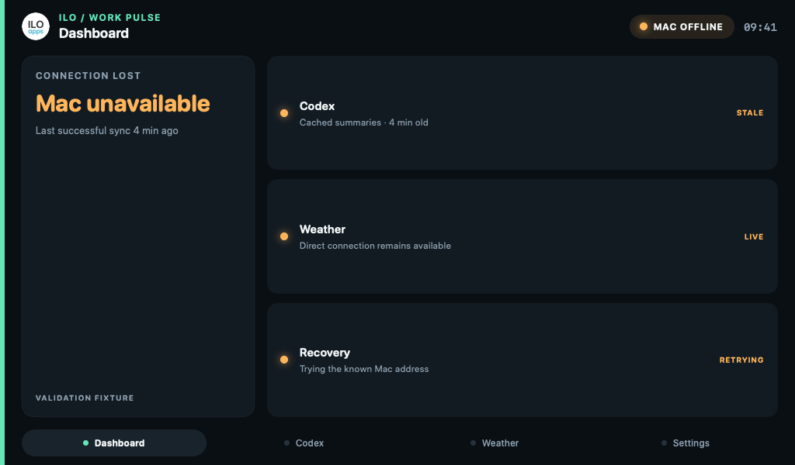
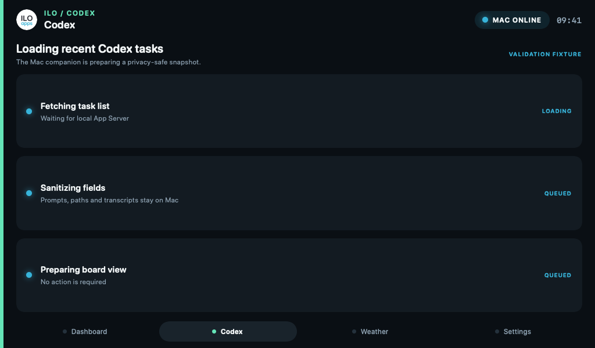
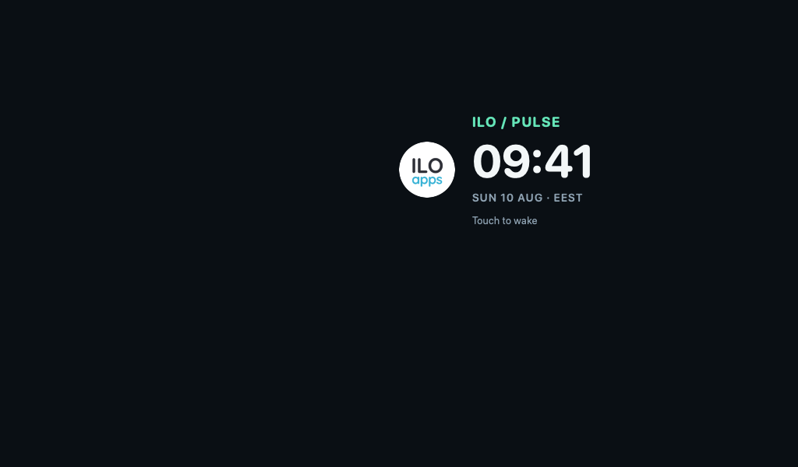
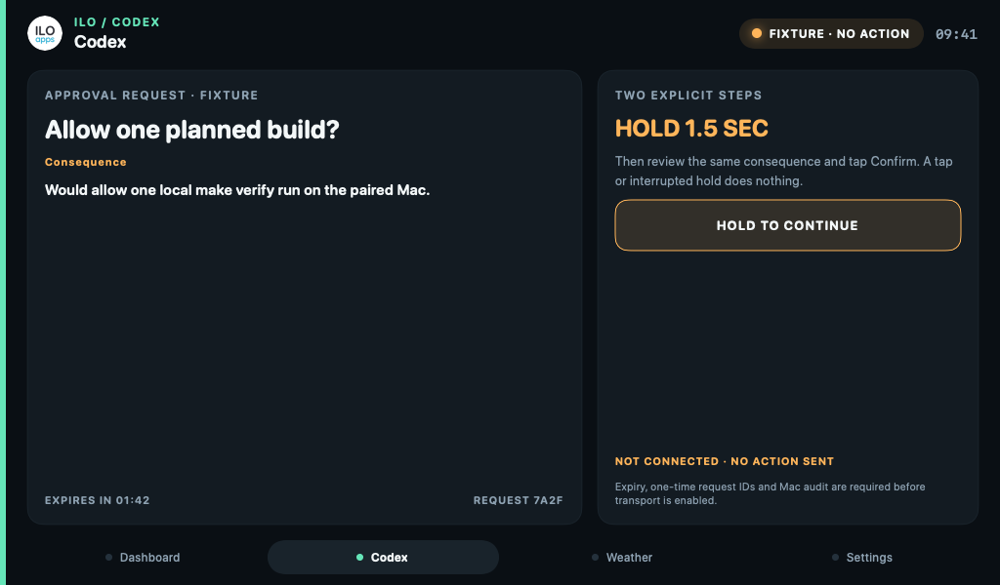
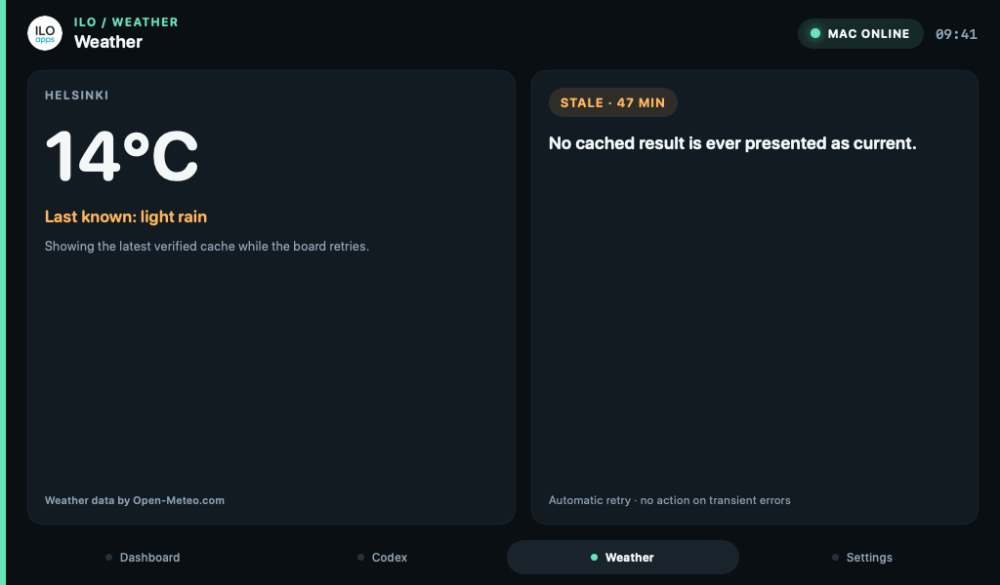
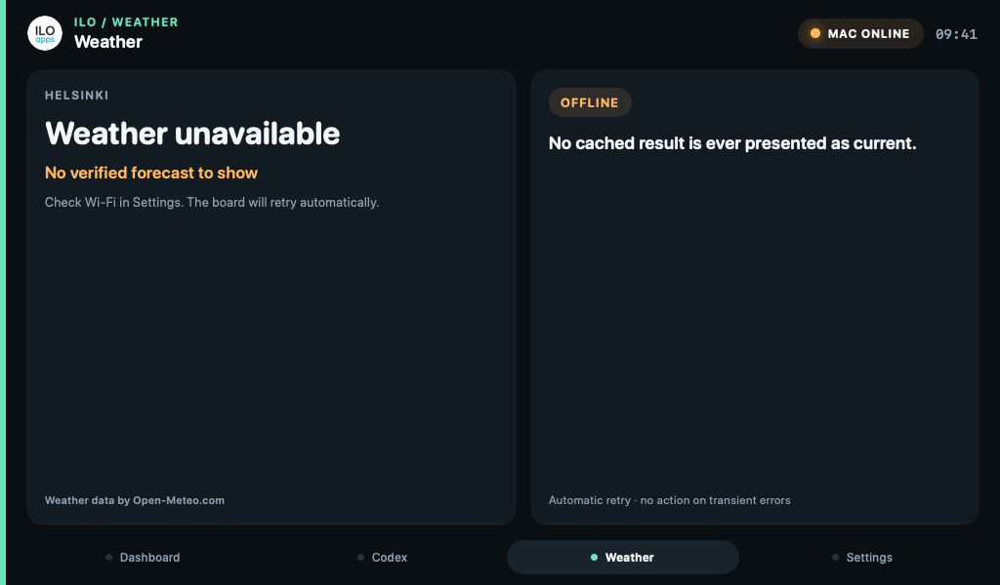
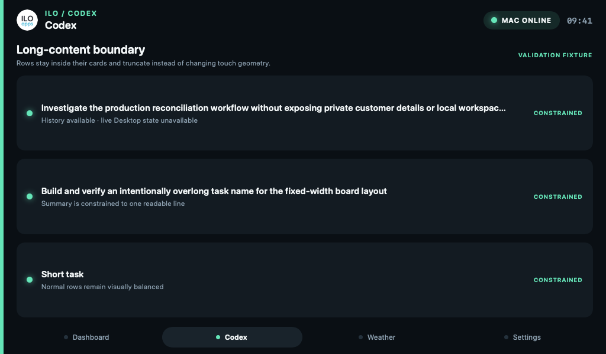
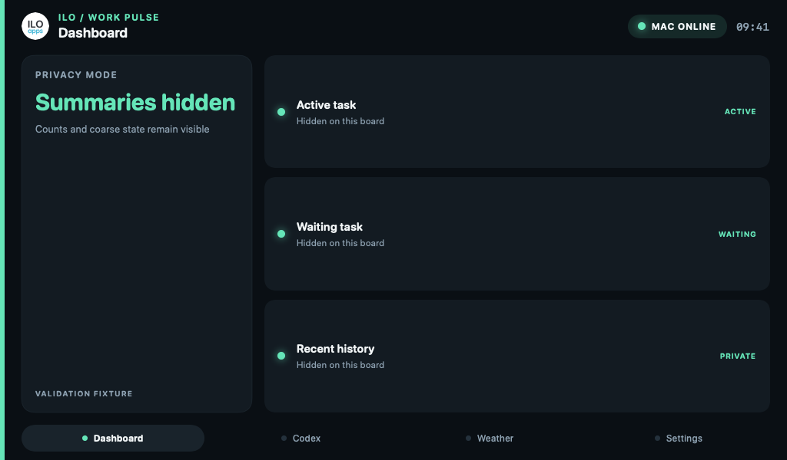
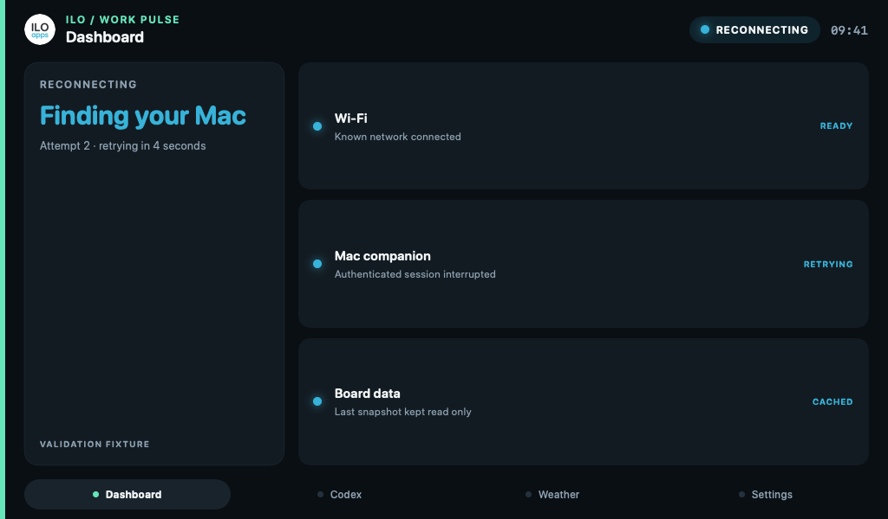

# Deterministic UI state validation

The state gallery exercises the fixed **1024×600** product layout without hardware. It covers the non-happy paths most likely to cause ambiguous status, clipping, privacy leaks, or unsafe touch behavior later on the Waveshare 5B.

Generate every fixture with:

```bash
swift run --package-path mac-service ilo-board-preview scenario-screenshots
```

Generate one fixture with:

```bash
swift run --package-path mac-service ilo-board-preview \
  scenario-screenshot --scenario long-text --output /tmp/ilo-long-text.png
```

Supported scenario names are `offline`, `loading`, `stale`, `error`, `long-text`, `privacy`, `sleep`, `reconnect`, `screensaver`, and `approval-request`. Default output is ignored under `artifacts/ui-states/`; the reviewed reference gallery is committed under `docs/images/ui-states/`.

The fixture model is intentionally disconnected from the live transport. It cannot claim that Wi-Fi, TLS, Codex, CH422G backlight control, or touch works. It proves only that each intended state has a deterministic label, page assignment, information hierarchy, and 1024×600 render.

| Scenario | Page | Required UX property |
| --- | --- | --- |
| Offline | Dashboard | Old Mac data is labeled cached/stale; direct weather remains conceptually independent. |
| Loading | Codex | Work is bounded and descriptive; there is no indefinite blank surface or fake live task. |
| Stale | Weather | Last-known values carry a visible age/state and attribution. |
| Error | Weather | No fabricated measurement; recovery guidance and automatic retry are explicit. |
| Long text | Codex | Private-safe fixture text truncates within one-line row geometry. |
| Privacy | Dashboard | Summaries are hidden while coarse state remains useful. |
| Sleep | Dashboard | The deterministic output is completely black; only hardware can prove the backlight is electrically off. |
| Reconnect | Dashboard | Wi-Fi, authenticated Mac session, and cached board data are distinguished. |
| Screensaver | Dashboard | Clock, date, timezone, and wake guidance remain readable in the moving Pulse treatment. |
| Approval request | Codex | Exact consequence and expiry are visible; hold and confirmation are separate; the fixture explicitly sends nothing. |

<p align="center">
  
  
</p>
<p align="center">
  
  
</p>
<p align="center">
  
  
</p>
<p align="center">
  
  
</p>
<p align="center">
  
  
</p>

## Review procedure

1. Run the focused Swift tests and regenerate the gallery.
2. Confirm every PNG is exactly 1024×600.
3. Review every label for truthfulness: live, stale, offline, cached, retrying, and private must not be interchangeable.
4. Inspect long text at 100% scale; title and detail must not overlap the badge or change row height.
5. Confirm provider attribution remains visible in both Weather failure fixtures.
6. Treat the black sleep PNG only as a desired visible result. Complete HW-303 through HW-305 in [the physical checklist](hardware-validation.md) before claiming display power/wake behavior.
7. Compare the same states on LVGL during the next hardware session. Exact typography is not required, but hierarchy, truncation, status semantics, and touch geometry are.

The approval fixture is a contract prototype, not a Codex control. Its state-machine tests prove that a tap or early confirmation does nothing, a completed hold only reveals the second step, expiry blocks all later input, and a request can be recorded once. Actual actuation remains disabled until the protocol provides authoritative live requests, signed one-time identifiers, expiry, replay rejection, an exact consequence, and an auditable Mac-side result.

The Python gallery test validates the complete filename set, PNG signatures, and dimensions. It intentionally does not pin byte hashes because OS font rasterization can change without changing layout semantics.
